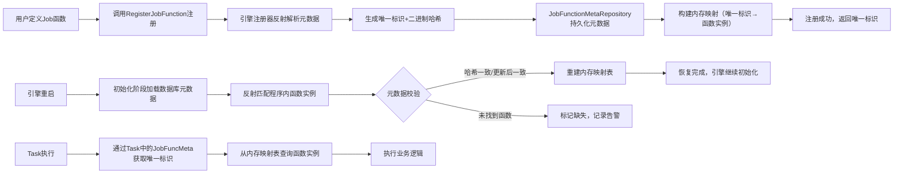
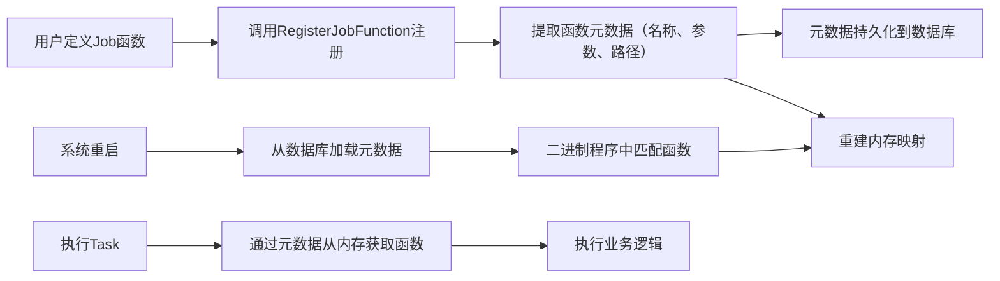

# 异步任务调度引擎详细设计

## 文档基础信息

|项目|内容|
|---|---|
|文档版本|V0.1|
|设计范围|核心特性详细设计（暂不包含SAGA事务、Cron定时调度）|
|关联文档|异步任务调度引擎设计文档|
|最后更新时间|2025-12-26|
## 1. 声明式任务定义

### 1.1 核心职责

通过Builder模式封装Workflow/Task的配置逻辑，提供简洁的链式API，让用户无需编写复杂编排代码即可完成任务流定义，聚焦量化数据同步、计算等核心业务逻辑。

### 1.2 设计细节

#### 1.2.1 核心组件

- **WorkflowBuilder**：负责Workflow模板的声明式配置，支持链式调用定义基础属性、Task集合等；依赖关系无需手动定义，Build时自动从各Task声明的依赖中提取构建；Workflow ID由系统自动生成UUID，无需手动设置

- **TaskBuilder**：负责单个Task的声明式配置，支持定义业务函数、执行参数、前置依赖Task等；Task ID由系统自动生成UUID，Task名称需保证唯一，无需手动设置ID

#### 1.2.2 关键API设计（移除SAGA、Cron相关接口）

|组件类型|核心方法（API）|参数说明|功能描述|
|---|---|---|---|
|WorkflowBuilder（构建器）|WithName(name string)|name：Workflow名称（字符串，用于标识业务含义）|设置Workflow的业务名称，便于可视化管理与日志追溯|
||WithTask(task Task)|task：Task实例（需提前通过TaskBuilder构建）|向当前Workflow中添加任务，支持批量多次调用添加多个Task|
||Build() (Workflow, error)|无入参|完成Workflow构建，自动生成Workflow UUID作为唯一标识，自动根据各Task声明的前置Task名称匹配对应的Task，提取依赖关系并构建全局依赖；若存在Task名称重复、依赖Task名称不存在等问题则返回错误|
|TaskBuilder（构建器）|WithJobFunction(fnName string, params map[string]interface{})|fnName：已注册的Job函数名称；params：函数执行参数（键值对，需匹配函数参数类型）|绑定Task对应的业务执行函数及参数，函数需提前通过注册API完成注册|
||WithTimeout(seconds int)|seconds：超时时间（整数，单位：秒；默认30秒）|设置Task的执行超时阈值，超时后将被标记为“超时失败”并中断执行|
||WithRetryCount(count int)|count：重试次数（整数，非负；默认0次，即不重试）|设置Task执行失败后的重试次数，仅对网络波动等非幂等性错误生效|
||WithDependency(depTaskID string)|depTaskName：依赖的前置Task名称（字符串，需为已构建的前置Task名称，且保证唯一）|为当前Task添加单个前置依赖Task，通过前置Task名称关联（依赖的Task名称需唯一），多次调用可添加多个依赖|
||WithDependencies(depTaskIDs []string)|depTaskNames：依赖的前置Task名称列表（字符串切片，元素为已构建的前置Task名称，且均保证唯一）|为当前Task批量添加前置依赖Task，通过前置Task名称关联（依赖的Task名称需唯一），适用于多前置依赖场景|
||Build() (Task, error)|无入参|完成Task构建，自动生成Task UUID作为唯一标识，校验Task名称唯一性；若函数未注册、参数不合法或名称重复则返回错误|
|Workflow（核心实体）|GetID() string|无入参|获取Workflow的唯一标识（系统自动生成的UUID）|
||GetName() string|无入参|获取Workflow的业务名称|
||GetTasks() map[string]Task|无入参|获取当前Workflow下的所有Task，返回Task UUID到Task实例的映射（包含各Task声明的依赖信息）|
||GetDependencies() map[string][]string|无入参|获取Task间的依赖关系，返回后置Task UUID到前置Task UUID列表的映射|
||AddSubTask(subTask Task, parentTaskID string) error|subTask：动态生成的子Task（ID为系统自动生成的UUID，名称需保证唯一）；parentTaskName：父Task名称（唯一）|运行时为Workflow添加动态子Task，并指定其父Task；若父Task不存在或子TaskID重复则返回错误|
||Validate() error|无入参|获取Task间的依赖关系，返回后置Task UUID到前置Task名称列表的映射（构建时通过名称匹配关联UUID）|
|Task（核心实体）|GetID() string|无入参|获取Task的唯一标识（系统自动生成的UUID）|
||GetJobFuncName() string|无入参|获取Task绑定的Job函数名称|
||GetParams() map[string]interface{}|无入参|获取Task的执行参数|
||UpdateParams(newParams map[string]interface{}) error|newParams：更新后的执行参数（键值对）|运行时更新Task的执行参数；若参数类型不匹配函数定义则返回错误|
||GetStatus() string|无入参|获取Task当前的执行状态（Pending/Running/Success/Failed/TimeoutFailed）|
|Engine（引擎核心）|Start() error|无入参|启动引擎，初始化Executor、Repository、状态管理器等核心组件；启动失败返回错误|
||Stop() error|无入参|停止引擎，中断所有正在执行的Task，记录断点数据，释放数据库连接、并发池等资源；停止失败返回错误|
||SubmitWorkflow(workflow Workflow) (WorkflowController, error)|workflow：构建完成的Workflow实例（ID为系统自动生成的UUID）|提交Workflow至引擎执行，返回WorkflowController实例，用于后续对该WorkflowInstance的生命周期管控（如暂停、恢复、终止）；若校验失败或引擎未启动则返回错误|
||GetWorkflowInstanceStatus(instanceID string) (string, error)|instanceID：WorkflowInstance唯一标识（系统自动生成的UUID）|查询指定WorkflowInstance的当前状态（Ready/Running/Paused/Terminated/Success/Failed）；若实例不存在则返回错误（也可通过SubmitWorkflow返回的WorkflowController直接调用GetStatus方法）|
||PauseWorkflowInstance(instanceID string) error|instanceID：WorkflowInstance唯一标识（系统自动生成的UUID）|暂停指定的WorkflowInstance，停止提交新Task，等待正在执行的Task完成后记录断点；若实例状态不支持暂停则返回错误（也可通过SubmitWorkflow返回的WorkflowController直接调用Pause方法）|
||ResumeWorkflowInstance(instanceID string) error|instanceID：WorkflowInstance唯一标识（系统自动生成的UUID）|恢复指定的WorkflowInstance，加载断点数据并继续执行；若实例状态不支持恢复则返回错误（也可通过SubmitWorkflow返回的WorkflowController直接调用Resume方法）|
|Executor（并发调度器）|SetPoolSize(maxSize int) error|maxSize：全局最大并发数（整数，需大于0且不超过CPU核心数2倍）|动态调整Executor的全局并发池大小；若参数不合法则返回错误|
||SetDomainPoolSize(domain string, size int) error|domain：业务域名称；size：该业务域的最大并发数（整数，需大于0）|动态调整指定业务域的子池大小；若业务域不存在或子池大小总和超过全局最大并发数则返回错误|
||SubmitTask(task *PendingTask) error|task：待调度的Task实例（包含Task UUID、Workflow UUID、业务域等信息）|将待调度Task提交至Executor的任务队列；若队列满或Task信息不完整则返回错误|
||GetDomainPoolStatus(domain string) (int, int, error)|domain：业务域名称|查询指定业务域子池的状态，返回（当前运行Task数，子池最大并发数）；若业务域不存在则返回错误|
||Shutdown() error|无入参|关闭Executor，中断所有正在执行的Task，清空待调度队列；若已关闭则返回错误|
|WorkflowController（生命周期控制器）|Pause() error|无入参|暂停当前关联的WorkflowInstance，停止提交新Task，等待正在执行的Task完成后记录断点；逻辑与Engine.PauseWorkflowInstance一致，无需额外传入instanceID（instanceID为系统自动生成的UUID）|
||Resume() error|无入参|恢复当前关联的WorkflowInstance，加载断点数据并继续执行；逻辑与Engine.ResumeWorkflowInstance一致，无需额外传入instanceID（instanceID为系统自动生成的UUID）|
||Terminate() error|无入参|终止当前关联的WorkflowInstance，中断所有正在执行的Task，记录终止原因并持久化状态；无需额外传入instanceID（instanceID为系统自动生成的UUID）|
||GetStatus() (string, error)|无入参|查询当前关联的WorkflowInstance状态（Ready/Running/Paused/Terminated/Success/Failed）；逻辑与Engine.GetWorkflowInstanceStatus一致，无需额外传入instanceID（instanceID为系统自动生成的UUID）|
||GetInstanceID() string|无入参|获取当前关联的WorkflowInstance唯一标识（系统自动生成的UUID），可用于后续通过Engine接口执行跨控制器的操作|
#### 1.2.3 WorkflowController说明

WorkflowController是Engine.SubmitWorkflow的返回对象，封装了对单个WorkflowInstance的生命周期管控能力，通过面向对象的方式简化状态操作逻辑，无需额外传入instanceID（instanceID为系统自动生成的UUID）。其核心方法如下：

- **Pause() error**：暂停当前关联的WorkflowInstance，逻辑与Engine.PauseWorkflowInstance一致；

- **Resume() error**：恢复当前关联的WorkflowInstance，逻辑与Engine.ResumeWorkflowInstance一致；

- **Terminate() error**：终止当前关联的WorkflowInstance，中断所有正在执行的Task并记录终止原因；

- **GetStatus() (string, error)**：查询当前关联的WorkflowInstance状态，逻辑与Engine.GetWorkflowInstanceStatus一致；

- **GetInstanceID() string**：获取当前关联的WorkflowInstance唯一标识。

#### 1.2.4 配置加载机制

- 支持通过代码直接调用Builder API定义（动态配置）；

- 支持将Builder配置序列化到内存结构（无需外部文件），避免依赖配置文件解析逻辑。

- 支持通过代码直接调用Builder API定义（动态配置）；

- 支持将Builder配置序列化到内存结构（无需外部文件），避免依赖配置文件解析逻辑。

### 1.3 关键流程

1. 用户初始化`WorkflowBuilder`，通过链式API设置基础属性（仅名称，ID由系统自动生成UUID）；

2. 初始化`TaskBuilder`，配置每个Task的业务名称（需唯一）、业务函数、超时时间、重试次数等（Task ID由系统自动生成UUID）；

3. 通过`WithTask`将Task添加至Workflow（Task的前置依赖已通过TaskBuilder的WithDependency/WithDependencies声明前置Task名称）；

4. 调用`Build()`方法生成`Workflow`实例，提交至引擎执行。

### 1.4 数据结构（移除SAGA、Cron相关字段）

```Go

```

### 1.5 约束条件

- 每个Task的`JobFunction`必须提前注册（通过Job函数自动注册机制）。

## 2. DAG自动编排

### 2.1 核心职责

解析Workflow中Task的依赖关系，生成无环有向图（DAG），自动规划Task执行顺序；支持运行时动态生成子Task并重新编排，适配量化数据处理中动态任务场景（如分片计算）。

- 链式API调用顺序无强制要求，但需保证Task名称唯一；

### 2.2 设计细节

#### 2.2.1 DAG解析器核心能力

- **依赖关系校验**：检测循环依赖（如TaskA依赖TaskB，TaskB依赖TaskA），若存在则抛出异常；

- **拓扑排序**：基于依赖关系生成Task执行顺序（无依赖的Task优先执行）；

- **动态更新**：接收子Task后重新构建DAG，更新执行顺序。

#### 2.2.2 执行顺序生成规则

1. 计算每个Task的“入度”（依赖的前置Task数量）；

2. 入度为0的Task加入“就绪队列”，可并行执行；

3. 当一个Task执行完成后，其所有下游依赖Task的入度减1；

4. 若下游Task入度变为0，加入就绪队列等待执行；

5. 重复步骤3-4，直至所有Task执行完成或终止。

#### 2.2.3 动态子任务处理机制

- **DAG重新编排**：引擎接收子Task后，自动将其加入当前WorkflowInstance的DAG，并重新计算依赖关系（默认子Task依赖其父Task）；

- **执行优先级**：子Task优先级低于同层级的兄弟Task，高于下游非子Task。

### 2.3 关键流程

1. WorkflowInstance启动时，DAG解析器加载Task列表及依赖关系；

- **子Task生成触发**：Task执行过程中可通过`GenerateSubTask(subTask Task)`接口生成子Task，子Task名称需保证唯一；

1. 执行依赖校验，若存在循环依赖则标记WorkflowInstance为“失败”并终止；

2. 生成拓扑排序结果，将入度为0的Task提交至Executor执行；

3. 监控Task执行状态，当Task完成后更新下游依赖Task的入度；

4. 若Task生成子Task，将子Task加入DAG并重新计算拓扑排序；

5. 重复步骤4-5，直至所有Task执行完成或WorkflowInstance被终止。

### 2.4 数据结构

```Go

```

### 2.5 约束条件

- Task依赖必须遵循“无环”规则，否则WorkflowInstance无法启动；

- 子Task数量上限由系统配置（默认单个Task最多生成1000个子Task，防止资源耗尽）。

## 3. 并发调度

### 3.1 核心职责

通过可配置的并发执行池（Executor）实现Task的并行执行，支持资源隔离与超时控制，适配量化数据高吞吐处理场景（如批量数据同步、并行计算）。

- 动态子Task的名称需全局唯一（避免与已有Task冲突），ID由系统自动生成UUID；

### 3.2 设计细节

#### 3.2.1 Executor核心属性

- **并发池大小**：可配置的最大并行执行Task数量（默认10，支持通过`executor.SetPoolSize(n)`动态调整）；

- **资源隔离策略**：按Workflow所属“业务域”隔离执行资源（如“行情数据”域与“交易数据”域使用独立子池）；

- **全局超时控制**：默认Task超时阈值（可被Task自身配置覆盖）。

#### 3.2.2 调度优先级规则

1. **业务域优先级**：高优先级业务域（如“实时计算”）的Task优先调度；

2. **依赖紧急度**：阻塞下游Task数量多的Task优先调度。

#### 3.2.3 超时与重试机制

- **超时监控**：Executor为每个Task启动独立计时器，超时后触发`TaskTimeout`事件，中断Task执行并标记为“超时失败”；

- **重试触发**：当Task因非幂等性错误（如网络波动）失败时，按`RetryCount`配置自动重试，每次重试间隔递增（1s、2s、4s...）。

### 3.3 关键流程

1. 引擎启动时初始化Executor；

2. DAG解析器将就绪Task提交至Executor的“待调度队列”；

3. Executor按优先级规则从队列中提取Task，分配至空闲Worker协程；

4. Worker协程加载Task的业务函数并执行，实时上报执行状态（运行中/成功/失败/超时）；

5. 若Task执行超时，Worker中断执行并触发超时回调；

6. 若Task执行失败且未达最大重试次数，将其重新加入待调度队列等待重试；

7. 用户初始化`WorkflowBuilder`，通过链式API设置基础属性（ID、名称）；

8. 初始化`TaskBuilder`，配置每个Task的业务函数、超时时间、重试次数，通过`WithDependency`/`WithDependencies`声明前置依赖；

9. 通过`WithTask`将Task添加至Workflow；

10. 调用`Build()`方法生成`Workflow`实例（自动构建全局依赖关系），提交至引擎执行。

### 3.4 数据结构

```Go

```

### 3.5 约束条件

- Task业务函数需保证幂等性（避免重试导致数据不一致）。

## 4. 多数据库适配

### 4.1 核心职责

通过接口化设计适配主流OLTP数据库（SQLite、PostgreSQL、MySQL），统一存储Workflow模板、实例运行数据、Task状态等，满足不同部署环境的存储需求。

### 4.2 设计细节

#### 4.2.1 存储接口抽象

初始化`TaskBuilder`，配置每个Task的业务名称（需唯一）、业务函数、超时时间、重试次数，通过`WithDependency`/`WithDependencies`声明前置依赖Task名称；

- `WorkflowRepository`：Workflow模板的CRUD操作；

- `WorkflowInstanceRepository`：WorkflowInstance的CRUD及状态更新；

- `TaskRepository`：Task实例的CRUD及状态更新；

- `JobFunctionMetaRepository`：Job函数元数据的存储与查询。

#### 4.2.2 数据库适配实现

|数据库类型|适配关键点|
|---|---|
|SQLite|单文件存储，适合轻量部署；通过`database/sql`驱动适配，事务支持有限（需显式开启）|
|PostgreSQL|支持JSONB类型存储复杂结构（如Task参数、DAG依赖）；适配其事务隔离级别|
|MySQL|适配InnoDB引擎的事务特性；使用`TEXT`类型存储长文本数据（如错误日志）|
#### 4.2.3 配置切换机制

- 通过配置项`storage.database_type`指定数据库类型（`sqlite`/`postgresql`/`mysql`）；

- 引擎启动时根据配置反射创建对应数据库的Repository实例；

- 支持运行时动态切换（需重启引擎，确保数据迁移完成）。

### 4.3 关键流程

1. 系统初始化时读取数据库配置，解析类型及连接参数（如地址、用户名、密码）；

2. 根据数据库类型初始化对应的驱动连接（如PostgreSQL通过`lib/pq`驱动）；

3. 创建Repository实例，绑定底层数据库连接；

4. 引擎运行过程中，所有存储操作通过Repository接口执行（如`workflowRepo.Save(workflow)`）；

5. Repository内部根据数据库类型执行适配的SQL语句（如PostgreSQL使用`INSERT ... RETURNING`获取自增ID，MySQL使用`LAST_INSERT_ID()`）。

### 4.4 核心表结构（通用抽象，移除SAGA、Cron相关字段）

|表名|核心字段|
|---|---|
|workflow_definition|id（PK）、name、dependencies（JSON）、create_time|
|workflow_instance|id（PK）、workflow_id（FK）、status、start_time、end_time、breakpoint（JSON）|
|task_instance|id（PK，系统自动生成的UUID）、name（唯一）、workflow_instance_id（FK）、status、start_time、end_time、error_msg|
|job_function_meta|id（PK）、name、param_types、code_path、create_time|
### 4.5 约束条件

- 数据库需支持事务（保证WorkflowInstance状态更新的原子性）；

- 不同数据库间迁移时需兼容JSON/TEXT字段（存储复杂结构）；

- SQLite仅适合单节点部署，高并发场景建议使用PostgreSQL。

## 5. 启停与断点恢复

### 5.1 核心职责

支持WorkflowInstance的全生命周期管控（启动/暂停/恢复/终止），并在系统重启或实例暂停后从断点续跑未完成任务，适配量化任务长周期执行场景（如跨天数据计算）。

### 5.2 设计细节

#### 5.2.1 生命周期状态机

```Plain Text

```

#### 5.2.2 断点数据组成

- **执行进度**：已完成的Task列表、当前运行中的TaskID；

- **上下文数据**：Task间传递的中间结果（如“前序Task计算的均线值”）；

- **状态快照**：当前DAG拓扑、各Task的入度与执行状态；

- **时间信息**：最后一次状态更新时间、已执行时长。

#### 5.2.3 核心操作机制

|操作|执行逻辑|
|---|---|
|暂停|1. 停止向Executor提交新Task；2. 等待正在执行的Task完成；3. 记录断点数据；4. 状态更新为“Paused”|
|恢复|1. 加载断点数据；2. 从最后未完成的Task开始重新计算DAG；3. 状态更新为“Running”；4. 提交就绪Task至Executor|
|终止|1. 中断所有正在执行的Task；2. 记录终止原因；3. 状态更新为“Terminated”|
|启动|1. 初始化DAG；2. 提交就绪Task至Executor；3. 状态更新为“Running”|
### 5.3 关键流程（断点恢复）

1. 系统重启或用户触发“恢复”操作时，引擎加载目标WorkflowInstance的断点数据；

2. 校验断点数据完整性（如Task状态、上下文是否完整）；

3. 重建DAG拓扑，基于断点中“已完成Task列表”更新各Task入度；

4. 恢复上下文数据（供未完成Task使用）；

5. 将当前状态更新为“Running”，并将就绪Task（入度为0）提交至Executor；

6. 按正常调度流程继续执行，直至完成或再次暂停/终止。

### 5.4 数据结构（移除SAGA相关字段）

```Go

```

### 5.5 约束条件

- 断点数据仅在“暂停”“终止”“系统异常退出”时记录，运行中不实时更新（避免性能损耗）；

- 上下文数据大小上限为10MB（防止存储膨胀，大文件需通过外部存储管理）；

- 恢复操作仅对“Paused”或“异常终止”状态的实例有效。

## 6. Job函数自动注册与重启恢复

### 6.1 核心职责

自动管理Task的业务函数（JobFunction）的注册、元数据持久化，以及系统重启后的函数实例重建，降低用户手动注册成本；同时保障函数调用的合法性与一致性，为Task执行提供可靠的函数支撑。

### 6.2 设计细节

#### 6.2.1 元数据组成

- 函数唯一标识（名称+参数类型签名哈希组合，确保全局唯一）；

- 函数加载路径（包路径+函数名，如“quant/data/sync.ImportKlineData”，用于重启时定位函数）；

- 注册时间与更新时间（用于追踪函数生命周期）。

#### 6.2.2 注册机制（引擎内部交互流程）

1. 用户通过`RegisterJobFunction(name string, fn interface{})`接口提交函数注册请求；

- 已完成的Task名称列表、当前运行中的Task名称；

1. 引擎注册器接收请求后，通过反射机制解析函数元数据（参数类型、返回值类型、包路径等）；

```Plain Text


// WorkflowInstance状态
type WorkflowInstanceState struct {
    ID            string                 // 实例ID（系统自动生成的UUID）
    Status        string                 // 状态（Ready/Running/Paused/Terminated/Success/Failed）
    Breakpoint    *BreakpointData        // 断点数据（仅Paused/Terminated状态有值）
    StartTime     time.Time              // 启动时间
    EndTime       *time.Time             // 结束时间（成功/终止/失败时设置）
    ErrorMessage  string                 // 错误信息（失败时设置）
}

// 断点数据
type BreakpointData struct {
    CompletedTaskNames []string            // 已完成的Task名称
    RunningTaskNames   []string            // 暂停时正在运行的Task名称
    DAGSnapshot      *DAG                // DAG拓扑快照
    ContextData      map[string]interface{} // 上下文数据（Task间传递的中间结果）
    LastUpdateTime   time.Time           // 最后更新时间
}
```

1. 生成函数唯一标识：结合函数名称与参数类型签名进行哈希计算，确保同名称不同参数的函数不冲突；

2. 计算函数二进制哈希：读取函数编译后的二进制字节流，通过MD5算法生成哈希值；

3. 元数据持久化：注册器调用`JobFunctionMetaRepository`接口，将元数据写入数据库，确保持久化成功后再执行后续步骤；

4. 内存映射构建：在引擎内存中维护“函数唯一标识→函数实例”的映射表（并发安全Map），供Task执行时快速查询调用；

5. 注册结果反馈：若元数据重复或解析失败，返回注册失败错误；成功则返回函数唯一标识。

#### 6.2.3 重启恢复流程（引擎内部交互流程）

1. 引擎启动初始化阶段，触发函数元数据加载流程，通过`JobFunctionMetaRepository.ListAll()`接口从数据库查询所有已注册的函数元数据；

2. 初始化空的内存映射表，开启并发安全锁（避免多协程操作冲突）；

3. 遍历元数据列表，通过“函数加载路径”在当前程序二进制中匹配对应的函数实例：

4. a. 解析加载路径中的包名与函数名，通过反射机制从程序内存中查找目标函数；

5. b. 若未找到函数，标记为“函数缺失”，记录告警日志，后续依赖该函数的Workflow无法执行；

6. c. 若找到函数，重新计算其二进制哈希，与元数据中的哈希值比对；

7. 哈希校验处理：

8. a. 哈希一致：将“函数唯一标识→函数实例”写入内存映射表；

9. b. 哈希不一致：说明函数已变更，触发元数据更新流程，用当前函数的元数据覆盖数据库中的旧数据，再写入内存映射表，并记录版本变更日志；

10. 内存映射初始化完成：释放并发安全锁，向引擎初始化管理器反馈函数恢复完成信号，引擎继续执行后续初始化步骤（如Executor、DAG解析器初始化）。

### 6.3 关键流程（全链路梳理）


### 6.4 数据结构

```Plain Text


// 函数元数据
type JobFunctionMeta struct {
    ID           string   // 唯一标识（名称+参数签名哈希）
    Name         string   // 函数名称
    ParamTypes   []string // 参数类型列表（如"int","string","[]float64"）
    CodePath     string   // 代码路径（如"quant/data/sync.ImportKlineData"）
    Hash         string   // 函数二进制哈希（用于版本校验）
    CreateTime   time.Time// 注册时间
    UpdateTime   time.Time// 最后更新时间
}

// 引擎内存中的函数映射表（并发安全）
type JobFunctionMap struct {
    sync.RWMutex
    FuncMap map[string]interface{} // key: 函数唯一标识，value: 函数实例
}
```

### 6.5 约束条件

- 函数名称+参数类型需唯一，否则注册时触发冲突校验，返回失败；

- 函数必须为纯函数（无内部状态、无副作用），确保多次调用及重启后执行结果一致；

- 函数参数与返回值需支持序列化/反序列化，便于Task执行时参数传递与结果存储；

- 系统重启时，若二进制程序中函数被删除或路径变更，依赖该函数的Workflow将被标记为“函数缺失”，需重新注册函数后才能执行。

### 6.1 核心职责

自动管理Task的业务函数（JobFunction）的注册、元数据持久化，以及系统重启后的函数实例重建，降低用户手动注册成本。

### 6.2 设计细节

#### 6.2.1 元数据组成

- 函数唯一标识（名称+参数类型签名）；

- 函数加载路径（如包路径+函数名）；

- 参数类型列表（用于校验调用合法性）；

- 函数二进制哈希（用于版本校验）。

#### 6.2.2 注册机制

1. 用户定义函数时，通过`RegisterJobFunction(name string, fn interface{})`显式注册；

2. 系统自动提取函数元数据并持久化至数据库；

3. 内存中维护“函数标识→函数实例”的映射表，供Task执行时快速查询。

#### 6.2.3 重启恢复流程

1. 系统启动时，从数据库加载所有函数元数据；

2. 遍历二进制程序中的函数，通过“加载路径”匹配元数据；

3. 重建“函数标识→函数实例”的内存映射；

4. 校验元数据与二进制函数的哈希一致性（不一致则告警，使用二进制函数覆盖元数据）。

### 6.3 关键流程


### 6.4 数据结构

```Go

```

### 6.5 约束条件

- 函数名称+参数类型需唯一（避免注册冲突）；

- 函数必须为纯函数（无内部状态，确保重启后行为一致）；

- 系统重启时，若二进制程序中函数被删除，依赖该函数的Workflow将无法执行（标记为“函数缺失”）。

## 7. 引擎核心工作流程细化

### 7.1 核心流程概述

引擎内部工作流程围绕“任务提交→解析编排→并发执行→状态存储→断点恢复”全链路展开，涉及Builder、DAG解析器、Executor、Repository、状态管理器等核心组件的协同交互，确保任务高效、可靠执行。以下是各关键阶段的详细内部流程。

### 7.2 阶段一：任务提交与初始化（引擎启动→Workflow提交）

1. 引擎启动初始化：

2. a. 加载系统配置（Executor并发池大小、默认超时、数据库类型等）；

3. b. 初始化数据库连接，创建各Repository实例（WorkflowRepository、TaskRepository等）；

4. c. 执行Job函数恢复流程，重建内存函数映射表（见6.2.3节）；

5. d. 初始化Executor并发池，创建指定数量的Worker协程，启动任务调度器；

6. e. 初始化状态管理器，用于维护WorkflowInstance与Task的实时状态；

7. 用户提交Workflow：

8. a. 用户通过WorkflowBuilder链式API构建Workflow实例，调用`Submit(workflow Workflow)`接口提交至引擎；

9. b. 引擎接收后，先校验Workflow合法性（ID唯一、TaskID不重复、无循环依赖预校验）；

10. c. 若校验失败，返回提交失败错误；成功则通过`WorkflowRepository.Save(workflow)`持久化Workflow模板；

11. d. 状态管理器创建WorkflowInstance实例，初始状态设为“Ready”，记录启动时间，通过`WorkflowInstanceRepository.Save(instance)`持久化实例信息。

### 7.3 阶段二：DAG解析与任务编排（Ready→Running）

1. 状态管理器将WorkflowInstance状态更新为“Running”，并触发DAG解析器工作；

2. DAG解析器加载Workflow中的Task列表与依赖关系：

3. a. 构建DAG拓扑结构（Nodes集合、入度、出边），具体见2.4节数据结构；

4. b. 执行循环依赖校验：通过深度优先搜索（DFS）遍历DAG，若发现环则标记WorkflowInstance为“Failed”，记录错误日志并终止流程；

5. c. 校验通过后，执行拓扑排序，生成初始就绪Task列表（入度为0的Task）；

6. d. 将初始就绪Task列表提交至Executor的待调度队列，并记录Task的初始状态（“Pending”）。

### 7.4 阶段三：并发调度与任务执行（Running阶段核心）

1. Executor调度器工作：

2. b. 检查当前业务域子池是否有空闲Worker协程，若有则分配Task，无则等待协程释放；

3. Worker协程执行Task：

4. a. 接收Task后，更新Task状态为“Running”，并通过`TaskRepository.UpdateStatus(taskID, "Running")`持久化状态；

5. b. 从内存函数映射表中查询Task绑定的JobFunction实例（通过JobFuncMeta中的唯一标识）；

6. b. 引擎接收后，先校验Workflow合法性（Task名称唯一、无循环依赖预校验）；

7. c. 校验Task参数与函数参数类型的匹配性，匹配失败则标记为“Failed”，记录错误并终止执行；

8. d. 启动Task超时计时器（按Task的TimeoutSeconds配置），若超时则触发中断逻辑，标记Task为“TimeoutFailed”；

9. e. 正常执行JobFunction，捕获执行过程中的异常：

10. ii. 有异常：检查剩余重试次数，若有则将Task重新加入待调度队列，更新重试次数，等待重试；若无则标记为“Failed”；

11. Task执行完成后，Worker协程反馈结果至DAG解析器：

12. a. DAG解析器接收Task完成信号，遍历该Task的下游依赖Task；

13. b. 为每个下游依赖Task的入度减1，若入度变为0，则将其加入待调度队列，状态设为“Pending”；

14. b. 检查当前业务域子池是否有空闲Worker协程，若有则分配Task，无则等待协程释放；

15. c. 若Task执行过程中生成子Task（通过`GenerateSubTask`接口）：

16. i. 校验子TaskID唯一性，若冲突则拒绝生成；

17. ii. 将子Task加入当前DAG，设置其父TaskID，更新下游依赖关系；

18. iii. 重新执行拓扑排序，更新待调度队列；

19. 重复步骤1-3，直至所有Task执行完成或WorkflowInstance被暂停/终止。

### 7.5 阶段四：状态存储与全链路持久化

1. 关键状态变更触发持久化：

2. a. WorkflowInstance状态变更（Ready→Running→Success/Failed/Paused/Terminated）；

3. b. Task状态变更（Pending→Running→Success/Failed/TimeoutFailed）；

4. c. DAG拓扑变更（新增子Task）；

5. d. 断点数据记录（暂停/终止时）；

6. 持久化机制：

7. a. 采用“事务+批量提交”结合的方式：单个Task状态变更用单条更新语句，批量Task状态变更（如批量加入就绪队列）用批量更新；

8. b. 所有持久化操作通过Repository接口执行，屏蔽底层数据库差异；

9. c. 持久化失败时，触发重试机制，重试3次仍失败则记录告警日志，确保状态数据不丢失。

### 7.6 阶段五：暂停/终止与断点恢复

### 7.7 核心组件交互关系

各组件通过接口解耦，交互流程如下：
Builder → 状态管理器（创建WorkflowInstance）→ DAG解析器（生成DAG/拓扑排序）→ Executor（调度/执行Task）→ Repository（持久化状态/元数据）；
状态变更触发链路：Worker协程 → 状态管理器 → Repository；
断点数据流转：状态管理器 → DAG解析器 → Executor（恢复执行）。

## 总结

本文档基于原始设计优化，移除了暂不实现的SAGA事务、Cron定时调度特性，聚焦核心可用功能：声明式任务定义、DAG自动编排、并发调度、多数据库适配、启停与断点恢复、Job函数自动注册与重启恢复，并新增引擎核心工作流程细化章节。

优化后的设计不仅保持了引擎的高可用性、可扩展性与易用性，还通过细化引擎内部工作流程，明确了各组件的协同交互逻辑与数据流转链路，降低了后续开发与维护成本。去除冗余特性后更聚焦量化数据同步、计算、分析等核心场景的异步任务调度需求，同时为后续扩展SAGA事务、定时调度预留了架构兼容空间。
> （注：文档部分内容可能由 AI 生成）