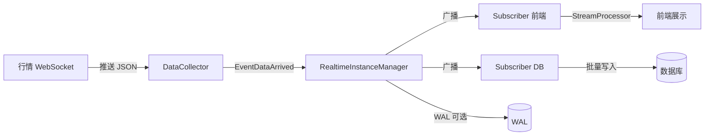

# 实时 Workflow 开发指南：股票行情与新闻数据同步

本文档面向使用 Task Engine 的开发者，介绍如何基于**实时 Workflow（Streaming）** 构建**股票行情**与**新闻数据**的实时同步能力。涉及的核心包：`pkg/core/realtime`、`pkg/core/builder`。

---

## 1. 概念概览

### 1.1 执行模式

- **Batch（批处理）**：Workflow 按 DAG 顺序执行，任务跑完即结束。
- **Streaming（流处理）**：Workflow 以**持续运行**的实例存在，内部由**持续任务（Continuous Task）** 长期运行，适合行情、新闻等实时数据接入。

实时行情/新闻场景应使用 **Streaming** 模式。

### 1.2 任务执行模式（RealtimeTask）


| 模式   | 常量                         | 说明                                         |
| ---- | -------------------------- | ------------------------------------------ |
| 一次性  | `ExecutionModeOneShot`     | 传统批处理任务，跑一次结束                              |
| 持续运行 | `ExecutionModeContinuous`  | 长期运行，需配合 `ContinuousTaskConfig`（端点、重连、缓冲等） |
| 事件驱动 | `ExecutionModeEventDriven` | 由事件总线驱动，通过 `EventSubscriptions` 订阅事件       |


做**行情/新闻同步**时，通常用 **Continuous**：一个任务连行情源，一个连新闻源（或轮询新闻 API）。

### 1.3 持续任务类型（ContinuousTaskType）

在 `ContinuousTaskConfig` 中通过 `Type` 指定：


| 类型    | 常量                        | 说明                                 |
| ----- | ------------------------- | ---------------------------------- |
| 数据采集器 | `TaskTypeDataCollector`   | 从外部源拉取/接收数据（如 WebSocket 行情、新闻 API） |
| 流处理器  | `TaskTypeStreamProcessor` | 从内部缓冲区消费数据并处理（如落库、告警）              |
| 事件监听器 | `TaskTypeEventListener`   | 监听事件总线上某类事件并响应                     |
| 定时轮询器 | `TaskTypeScheduledPoller` | 按固定间隔轮询（如定时拉新闻）                    |


**典型组合**：

- **行情**：`TaskTypeDataCollector`（WebSocket 行情）→ 数据进入缓冲区 → `TaskTypeStreamProcessor` 消费并落库/推送。
- **新闻**：`TaskTypeScheduledPoller` 或 `TaskTypeDataCollector`（长连接推送）拉新闻，再经缓冲区由流处理器写入存储。

### 1.4 本次更新：多订阅者广播与 WAL

在原有“单 Buffer + 多 StreamProcessor 抢消费”的基础上，现已支持：

- **多订阅者广播（SPMC）**：同一份数据可被多个**订阅者**各自独立消费。每个订阅者拥有独立 `DataBuffer`，可配置不同容量与推入策略（阻塞 / 非阻塞满则丢），从而同时支撑“关键下游尽量不丢”（如 DB）与“非关键下游偏实时、可丢”（如前端推送）。
- **本地 WAL（Write-Ahead Log）**：在广播前先写 WAL，处理成功后确认；进程重启时回放未确认记录，实现进程内 **at-least-once** 近似语义。WAL 存储支持内存、文件与 **Badger**。
- **优雅关闭**：`TerminateWorkflowInstance` 触发后，先停止接收新数据，在超时内尽量让已入缓冲的数据被消费并完成 WAL 确认，再关闭实例。

配置方式：在 **WorkflowBuilder** 上使用 `WithBroadcastEnabled(true)`、`WithWalEnabled(true)`；在 **RealtimeTaskBuilder** 上为每个流处理任务指定 `WithSubscriberName(name)` 与 `WithBufferPolicyBlocking(cap)` 或 `WithBufferPolicyNonBlockingDrop(cap)`。设计细节与 API 说明见 [Realtime Workflow 广播与至少一次语义设计](realtime-workflow-spmc-support.md)。

---

## 2. 核心组件与数据流

### 2.1 组件关系

```
Workflow (ExecutionMode=streaming)
  └── RealtimeInstanceManager
        ├── 持续任务（ContinuousTask）列表
        ├── DataBuffer（背压缓冲；未开广播时为全局单 Buffer）
        ├── 订阅者（Subscriber）与独立 Buffer（开启广播时，每个订阅者一个 Buffer）
        ├── WAL 存储（可选，开启 WAL 时用于 at-least-once）
        ├── 事件总线（Watermill Pub/Sub）
        └── 内部/外部事件处理
```

- **RealtimeInstanceManager**：在 `Engine.SubmitWorkflow` 时，若 Workflow 为 `streaming`，则由 Engine 创建并用来管理该实例。
- **持续任务**：由 `RealtimeTask` 的 `ExecutionMode == ExecutionModeContinuous` 且 `ContinuousConfig != nil` 解析而来，启动后按 `ContinuousTaskConfig.Type` 执行对应逻辑（见 `realtime_instance_manager.go` 中 `executeTaskLogic`）。
- **DataBuffer**：接收“数据到达”事件推送的原始数据，供流处理器消费；满时触发背压（可配置阈值与动作）。
- **事件**：连接建立/断开、重连、数据到达、背压、任务启停等都会发出 `RealtimeEvent`，可订阅做监控或联动。

### 2.2 数据流简述

1. **数据采集任务**（如行情 WebSocket）收到数据后，应发布 `EventDataArrived`，payload 为 `DataArrivedPayload`（或兼容的 `map`）。
2. 内部处理器 `handleDataArrived`：
  - **未开启广播**：将 `Payload.Data` 推入全局 **DataBuffer**（`Push`）；若因背压丢弃则计入失败指标。
  - **开启广播**：可选先写 **WAL**，再向各 **Subscriber** 的独立 Buffer 广播（Blocking 订阅者用 `PushBlocking`，NonBlockingDrop 用 `Push`，满则丢并计指标）。
3. **流处理任务**（`TaskTypeStreamProcessor`）在 `runStreamProcessor` 中从**对应订阅者的** DataBuffer（或全局 Buffer）`Pop` 消费；若配置了 **DataHandler** 且 Engine 传入了 FunctionRegistry，会以 `params["data"]`、`params["sequence_id"]`（广播场景）调用该 Job 函数，成功后对 WAL 做确认，再发布 `EventDataProcessed`。
4. 背压：缓冲区使用率超过配置阈值时发布 `EventBackpressure`，低于一半阈值时发布 `EventBackpressureRelieved`。

数据采集的两种方式（二选一或组合）：

- **推荐：Workflow 内注册采集器**：实现 `realtime.DataCollector` 接口，在 **WorkflowBuilder** 上使用 **WithDataCollector(name, collector)** 注册（与 WithRealtimeTask 同处构建），在 RealtimeTaskBuilder 上使用 **WithCollector(name)**。引擎在运行时会调用 `collector.Run(ctx, config, publish)`，你在收到数据时调用 `publish(NewRealtimeEvent(EventDataArrived, ...))` 即可把数据写入缓冲。若需在采集端打印或打点，可在 `publish` 前加日志。消费端由 **StreamProcessor** 任务从 buffer Pop 并调用 DataHandler（见 3.5、3.8）。**兼容**：也可在 **EngineBuilder.WithDataCollector** 处注册，Engine 在 Workflow 未带注册表时会回退使用。
- **可选：用户侧 PublishEvent**：在业务侧持有 RealtimeInstanceManager 引用，自行建连（WebSocket/HTTP），在收到数据时调用 **RealtimeInstanceManager.PublishEvent** 发布 `EventDataArrived`。无注册采集器时，任务会走占位逻辑（如 sleep），你可在外部注入数据。

---

## 3. 用 Builder 定义实时 Workflow

### 3.1 基本步骤

1. 使用 **RealtimeTaskBuilder** 定义实时任务（端点、任务类型、缓冲、重连、事件订阅等）。
2. 使用 **WorkflowBuilder** 的 **WithStreamingMode** 和 **WithRealtimeTask** 组成 Workflow。
3. 通过 **Engine.SubmitWorkflow** 提交，Engine 会创建 **RealtimeInstanceManager** 并启动其中的持续任务。

### 3.2 注册函数（Registry）

流处理任务使用的 DataHandler、以及采集/事件处理等若通过“函数名”配置，需在 Engine 的 **FunctionRegistry** 中注册。Engine 创建 RealtimeInstanceManager 时会传入该 Registry（`WithFunctionRegistry`），供 `runStreamProcessor` 按名调用 DataHandler。

```go
registry := eng.GetRegistry()
_, _ = registry.Register(ctx, "print_data_job", printDataJob, "打印收到的数据")
// 流处理任务通过 WithJobFunction("print_data_job", nil) 引用；WithJobFunction 会同步设置 DataHandler
```

DataHandler 函数签名为 `func(ctx *task.TaskContext) error`，从 `ctx.Params["data"]` 取缓冲中 Pop 出的单条数据。

### 3.3 定义行情采集任务（示例）

```go
// 假设 registry 为 eng.GetRegistry()
quoteTask, err := builder.NewRealtimeTaskBuilder("stock_quote_collector", "股票行情采集", registry).
    WithContinuousMode().
    WithEndpoint("wss://quote.example.com/ws", "ws").
    WithTaskType(realtime.TaskTypeDataCollector).
    WithBuffer(10000, 100).                    // 缓冲区10000，批大小 100
    WithFlushInterval(5 * time.Second).
    WithReconnect(true, 0).                    // 启用重连，0 表示无限次
    WithReconnectBackoff(time.Second, 30*time.Second, 2.0).
    WithBackpressure(0.8, "throttle").
    WithDataHandler("handleQuote").
    WithErrorHandler("onError").
    Build()
if err != nil {
    return err
}
```

- **WithEndpoint**：逻辑端点与协议，实际连接在你自己实现的采集逻辑里使用。
- **WithTaskType(TaskTypeDataCollector)**：该任务在实例内会按“数据采集器”类型调度（当前默认实现是占位，真实拉取需在业务侧完成并向事件总线发布 `EventDataArrived`）。
- **WithBuffer / WithFlushInterval**：与缓冲、批处理相关配置（部分会落到 `ContinuousTaskConfig`，供实例管理器或你自定义逻辑使用）。
- **WithReconnect***：重连开关与退避；断开连接时会发布 `EventDisconnected`，内部可触发 `handleReconnect`。

### 3.4 定义新闻轮询任务（示例）

```go
newsTask, err := builder.NewRealtimeTaskBuilder("news_poller", "新闻定时拉取", registry).
    WithContinuousMode().
    WithEndpoint("https://api.news.example.com/v1/news", "http").
    WithTaskType(realtime.TaskTypeScheduledPoller).
    WithFlushInterval(1 * time.Minute).        // 每分钟拉一次
    WithBuffer(5000, 50).
    WithDataHandler("handleNews").
    Build()
if err != nil {
    return err
}
```

- **TaskTypeScheduledPoller**：与 DataCollector 统一走 **runDataCollector**，由 **Mode=pull** 与 `FlushInterval` 等配置区分；真实拉取需实现 **DataCollector** 并在 `Run` 内按间隔请求后 **publish(EventDataArrived, ...)**（或使用用户侧 PublishEvent）。

### 3.5 定义流处理任务（消费缓冲数据）

若希望由引擎的 DataBuffer 统一接收数据，再由“流处理任务”消费（如落库、告警、打印），可增加一个 **StreamProcessor** 任务。使用 **WithJobFunction(name, nil)** 即可，会同步设置 DataHandler，供 `runStreamProcessor` 从 buffer Pop 后按名调用：

```go
streamTask, err := builder.NewRealtimeTaskBuilder("quote_stream_processor", "行情流处理", registry).
    WithContinuousMode().
    WithTaskType(realtime.TaskTypeStreamProcessor).
    WithJobFunction("handleQuote", nil).   // 同步设置 DataHandler，runStreamProcessor 会以 params["data"] 调用
    Build()
```

- **TaskTypeStreamProcessor**：在 `runStreamProcessor` 中从 `DataBuffer.Pop` 取数据；若配置了 DataHandler 且 Engine 传入了 FunctionRegistry，会构造 `params["data"] = 单条数据` 并调用该 Job 函数，再发布 `EventDataProcessed`。

**DataHandler 失败重试（可选）**：若希望写入/处理失败时由框架自动重试，可链式调用 **WithDataHandlerMaxRetries(n)**（n 为最大重试次数）。失败时当前消息会重新入队，直到成功或达到 n 次重试；超限或重新入队时缓冲区已满则丢弃并计入错误。不设置或设为 0 时行为与旧版一致（失败即丢弃该条）。

```go
streamTask, err := builder.NewRealtimeTaskBuilder("quote_stream_processor", "行情流处理", registry).
    WithContinuousMode().
    WithTaskType(realtime.TaskTypeStreamProcessor).
    WithJobFunction("db_batch_write_job", nil).
    WithDataHandlerMaxRetries(3).   // 失败时最多重试 3 次
    Build()
```

### 3.6 事件订阅（可选）

若要对“数据到达”“背压”“连接断开”等做监控或联动，可在 Builder 上订阅事件：

```go
quoteTask, err = builder.NewRealtimeTaskBuilder(...).
    // ... 上述配置 ...
    SubscribeEvent(realtime.EventDataArrived, "onDataArrived").
    SubscribeEvent(realtime.EventBackpressure, "onBackpressure").
    Build()
```

对应处理函数需在 Registry 中按事件处理函数签名注册（具体签名需与引擎侧调用约定一致）。

### 3.7 组装 Workflow 并提交

流式 Workflow 的 **DataCollector 注册在 WorkflowBuilder 处完成**：**WithDataCollector(name, collector)**，name 与 RealtimeTaskBuilder.WithCollector(name) 一致。

```go
wf, err := builder.NewWorkflowBuilder("realtime_market", "实时行情与新闻同步").
    WithStreamingMode().             // 必须：流式执行
    WithDataCollector("quote_ws", quoteCollector).  // 推荐：在此处注册采集器
    WithRealtimeTask(quoteTask).     // 行情采集
    WithRealtimeTask(newsTask).     // 新闻轮询
    WithRealtimeTask(streamTask).   // 可选：流处理
    Build()
if err != nil {
    return err
}

ctrl, err := eng.SubmitWorkflow(ctx, wf)
if err != nil {
    return err
}
// ctrl.InstanceID() 即为本实例 ID，可用于后续 Pause/Resume/Terminate、查状态、查指标
```

注意：**WithRealtimeTask** 会向 Workflow 加入该实时任务，并保证 Workflow 以 **streaming** 模式运行（参见 `workflow_builder.go`）。

### 3.8 完整示例（基于 E2E 用例）

以下三种模式对应 `test/e2e/realtime_collector_e2e_test.go` 中的用例，可直接参考或裁剪使用。

**示例一：有限次 publish 采集器 + 流处理（最小闭环）**

采集器在 `Run` 内发布 N 条后 return，流处理任务从 buffer 消费并调用 DataHandler（如打印）：

```go
// 1) 实现 DataCollector：有限次 publish
type finitePublishCollector struct {
    maxPublish int32
    published  int32
}
func (c *finitePublishCollector) Run(ctx context.Context, config *realtime.ContinuousTaskConfig, publish realtime.PublishFunc) error {
    taskID := ""
    if config != nil {
        taskID = config.ID
    }
    for atomic.LoadInt32(&c.published) < c.maxPublish {
        select {
        case <-ctx.Done():
            return nil
        default:
        }
        n := atomic.AddInt32(&c.published, 1)
        e := realtime.NewRealtimeEvent(realtime.EventDataArrived, taskID, "", &realtime.DataArrivedPayload{
            Data: n, Source: "e2e_finite",
        })
        _ = publish(e)
        time.Sleep(10 * time.Millisecond)
    }
    return nil
}

// 2) DataHandler：从 ctx.Params["data"] 取单条数据（流处理时由 runStreamProcessor 注入）
func printDataJob(ctx *task.TaskContext) error {
    if len(ctx.Params) > 0 {
        b, _ := json.Marshal(ctx.Params)
        log.Printf("[printDataJob] TaskID=%s 收到数据: %s", ctx.TaskID, string(b))
    }
    return nil
}

// 3) 构建引擎、注册 DataHandler，再在 WorkflowBuilder 处注册采集器并组装 Workflow
eng, _ := engine.NewEngineBuilder(configPath).Build()
registry := eng.GetRegistry()
registry.Register(ctx, "print_data_job", printDataJob, "打印收到的数据")

collector := &finitePublishCollector{maxPublish: 5}
collectorTask, _ := builder.NewRealtimeTaskBuilder("e2e_collector", "e2e", registry).
    WithContinuousMode().
    WithTaskType(realtime.TaskTypeDataCollector).
    WithCollector("e2e_finite").
    WithJobFunction("print_data_job", nil).
    Build()

streamTask, _ := builder.NewRealtimeTaskBuilder("e2e_stream_processor", "流处理", registry).
    WithContinuousMode().
    WithTaskType(realtime.TaskTypeStreamProcessor).
    WithJobFunction("print_data_job", nil).
    Build()

wf, _ := builder.NewWorkflowBuilder("e2e_realtime_wf", "e2e").
    WithStreamingMode().
    WithDataCollector("e2e_finite", collector).
    WithRealtimeTask(collectorTask).
    WithRealtimeTask(streamTask).
    Build()
ctrl, _ := eng.SubmitWorkflow(ctx, wf)
```

**示例二：Pull 采集器（HTTP 分页）+ 流处理**

采集器按 `FlushInterval` 轮询 HTTP 接口（如 `GET /api/stk_mins?offset=0&limit=100`），逐条 publish；流处理任务同上。

```go
// 采集器：HTTP 分页拉取并 publish
type stkMinsPullCollector struct {
    client     *http.Client
    published  int32
    maxPublish int32
}
func (c *stkMinsPullCollector) Run(ctx context.Context, config *realtime.ContinuousTaskConfig, publish realtime.PublishFunc) error {
    taskID := config.ID
    baseURL := config.Endpoint
    interval := config.FlushInterval
    if interval <= 0 {
        interval = 200 * time.Millisecond
    }
    cli := c.client
    if cli == nil {
        cli = &http.Client{Timeout: 10 * time.Second}
    }
    offset := 0
    limit := 100
    for {
        select {
        case <-ctx.Done():
            return nil
        default:
        }
        req, _ := http.NewRequestWithContext(ctx, http.MethodGet,
            baseURL+"/api/stk_mins?offset="+strconv.Itoa(offset)+"&limit="+strconv.Itoa(limit), nil)
        resp, err := cli.Do(req)
        if err != nil {
            return err
        }
        var body struct {
            Data  []YourRow `json:"data"`
            Total int       `json:"total"`
        }
        _ = json.NewDecoder(resp.Body).Decode(&body)
        resp.Body.Close()
        for i := range body.Data {
            if c.maxPublish > 0 && atomic.LoadInt32(&c.published) >= c.maxPublish {
                return nil
            }
            e := realtime.NewRealtimeEvent(realtime.EventDataArrived, taskID, "", &realtime.DataArrivedPayload{
                Data: body.Data[i], Source: "stk_mins_pull",
            })
            _ = publish(e)
            atomic.AddInt32(&c.published, 1)
        }
        if len(body.Data) < limit {
            offset = 0
        } else {
            offset += len(body.Data)
        }
        select {
        case <-ctx.Done():
            return nil
        case <-time.After(interval):
        }
    }
}

// 任务与 Workflow（采集器在 WorkflowBuilder 处注册）
eng, _ := engine.NewEngineBuilder(configPath).Build()
registry := eng.GetRegistry()
registry.Register(ctx, "print_data_job", printDataJob, "打印收到的数据")

pullCollector := &stkMinsPullCollector{maxPublish: 50}
collectorTask, _ := builder.NewRealtimeTaskBuilder("stk_pull", "stk_mins_pull", registry).
    WithContinuousMode().
    WithTaskType(realtime.TaskTypeDataCollector).
    WithCollector("stk_mins_pull").
    WithMode(realtime.CollectorModePull).
    WithEndpoint(serverURL, "http").
    WithFlushInterval(300 * time.Millisecond).
    WithJobFunction("print_data_job", nil).
    Build()

streamTask, _ := builder.NewRealtimeTaskBuilder("stk_pull_processor", "流处理", registry).
    WithContinuousMode().
    WithTaskType(realtime.TaskTypeStreamProcessor).
    WithJobFunction("print_data_job", nil).
    Build()

wf, _ := builder.NewWorkflowBuilder("e2e_stk_pull_wf", "e2e").
    WithStreamingMode().
    WithDataCollector("stk_mins_pull", pullCollector).
    WithRealtimeTask(collectorTask).
    WithRealtimeTask(streamTask).
    Build()
```

**示例三：Push 采集器（WebSocket）+ 流处理**

采集器连接 WebSocket，循环 `conn.ReadJSON(&row)`，每收到一条就 `publish(EventDataArrived, row)`；流处理任务同上。

```go
// 采集器：WebSocket 长连接收包并 publish
type stkMinsPushCollector struct {
    maxPublish int32
    published  int32
}
func (c *stkMinsPushCollector) Run(ctx context.Context, config *realtime.ContinuousTaskConfig, publish realtime.PublishFunc) error {
    taskID := config.ID
    wsURL := config.Endpoint
    dialer := websocket.Dialer{HandshakeTimeout: 5 * time.Second}
    conn, _, err := dialer.DialContext(ctx, wsURL, nil)
    if err != nil {
        return err
    }
    defer conn.Close()
    for {
        select {
        case <-ctx.Done():
            return nil
        default:
        }
        if c.maxPublish > 0 && atomic.LoadInt32(&c.published) >= c.maxPublish {
            return nil
        }
        var row YourRow
        if err := conn.ReadJSON(&row); err != nil {
            if websocket.IsCloseError(err, websocket.CloseNormalClosure, websocket.CloseGoingAway) {
                return nil
            }
            return err
        }
        e := realtime.NewRealtimeEvent(realtime.EventDataArrived, taskID, "", &realtime.DataArrivedPayload{
            Data: row, Source: "stk_mins_push",
        })
        _ = publish(e)
        atomic.AddInt32(&c.published, 1)
    }
}

// 任务与 Workflow（采集器在 WorkflowBuilder 处注册）
eng, _ := engine.NewEngineBuilder(configPath).Build()
registry := eng.GetRegistry()
registry.Register(ctx, "print_data_job", printDataJob, "打印收到的数据")

pushCollector := &stkMinsPushCollector{maxPublish: 100}
collectorTask, _ := builder.NewRealtimeTaskBuilder("stk_push", "stk_mins_push", registry).
    WithContinuousMode().
    WithTaskType(realtime.TaskTypeDataCollector).
    WithCollector("stk_mins_push").
    WithMode(realtime.CollectorModePush).
    WithEndpoint(wsURL, "ws").
    WithJobFunction("print_data_job", nil).
    Build()

streamTask, _ := builder.NewRealtimeTaskBuilder("stk_push_processor", "流处理", registry).
    WithContinuousMode().
    WithTaskType(realtime.TaskTypeStreamProcessor).
    WithJobFunction("print_data_job", nil).
    Build()

wf, _ := builder.NewWorkflowBuilder("e2e_stk_push_wf", "e2e").
    WithStreamingMode().
    WithDataCollector("stk_mins_push", pushCollector).
    WithRealtimeTask(collectorTask).
    WithRealtimeTask(streamTask).
    Build()
```

三种模式共性：**采集器在 WorkflowBuilder 上通过 WithDataCollector(name, collector) 注册**，与 WithRealtimeTask 同处构建；**采集任务**（DataCollector）负责拉取/接收并 `publish(EventDataArrived)`，**流处理任务**（StreamProcessor）从 buffer 消费并执行 DataHandler。Engine 创建 RealtimeInstanceManager 时优先使用 Workflow 自带的 DataCollectorRegistry，并传入 `WithFunctionRegistry(e.registry)`，runStreamProcessor 才能按名调用 DataHandler。

---

## 4. 配置项说明

### 4.1 ContinuousTaskConfig（持续任务）


| 配置                         | 说明                                         | 建议（行情/新闻）                   |
| -------------------------- | ------------------------------------------ | --------------------------- |
| Endpoint / Protocol        | 逻辑端点与协议                                    | 行情：wss://...；新闻：https://... |
| ReconnectEnabled           | 是否自动重连                                     | 行情建议 true                   |
| MaxReconnectAttempts       | 最大重连次数，0 为不限                               | 0 或 10+                     |
| ReconnectBackoff           | InitialInterval / MaxInterval / Multiplier | 1s / 30s / 2.0 常用           |
| BufferSize / BatchSize     | 缓冲条数、批大小                                   | 按 QPS 与下游处理能力调整             |
| FlushInterval              | 刷新/轮询间隔                                    | 轮询新闻可用 1m～5m                |
| BackpressureThreshold      | 背压阈值 (0~1)                                 | 0.8                         |
| BackpressureAction         | drop / block / throttle                    | throttle 较稳妥                |
| DataHandler / ErrorHandler | 处理函数名                                      | 在 Registry 中注册              |
| DataHandlerMaxRetries      | DataHandler 失败时最大重试次数，0=不重试（失败即丢弃）           | 落库等关键路径可设 3～5              |


### 4.2 RealtimeInstanceManager 选项（创建实例时）

Engine 在创建 **RealtimeInstanceManager** 时使用的选项在 `pkg/core/realtime/options.go` 中定义，例如：

- **WithBufferSize(size)**：默认 10000。
- **WithBackpressureThreshold(threshold)**：默认 0.8。
- **WithCollectorRegistry(registry)**：采集器注册表，供 runDataCollector 按名查找。
- **WithFunctionRegistry(registry)**：函数注册表（需实现 `DataHandlerRegistry`，如 Engine 的 `e.registry`），供 runStreamProcessor 按 DataHandler 名调用 Job 函数。
- **WithShutdownTimeout(timeout)**：优雅关闭等待时间。
- **WithReconnectTimeout(timeout)**：单次重连尝试超时。

Engine 在 `createRealtimeInstanceManager` 中会传入 `WithCollectorRegistry(e.collectorRegistry)` 与 `WithFunctionRegistry(e.registry)`，因此流处理任务的 DataHandler 只需在 Engine 的 Registry 中注册即可被调用。

---

## 5. 事件类型与 Payload（events.go）

常用事件与 payload 结构（便于你在业务里发布或订阅）：


| 事件类型                                          | 说明         | Payload 类型          |
| --------------------------------------------- | ---------- | ------------------- |
| EventDataArrived                              | 数据到达（推入缓冲） | DataArrivedPayload  |
| EventDataProcessed                            | 单条数据处理完成   | DataArrivedPayload  |
| EventTaskStarted / Paused / Resumed / Stopped | 任务状态变化     | TaskStatusPayload   |
| EventConnected / EventDisconnected            | 连接建立/断开    | ConnectionPayload   |
| EventReconnecting / EventReconnected          | 重连中/成功     | ConnectionPayload   |
| EventError                                    | 错误         | ErrorPayload        |
| EventBackpressure / EventBackpressureRelieved | 背压触发/解除    | BackpressurePayload |


**DataArrivedPayload** 含：`Data`（原始数据）、`Source`、`Size`、`Sequence`、`BatchID`。  
业务侧在实现采集逻辑时，构造 **NewRealtimeEvent(EventDataArrived, taskID, instanceID, &DataArrivedPayload{...})** 并调用 **RealtimeInstanceManager.PublishEvent** 即可把行情/新闻写入引擎缓冲。

---

## 6. 缓冲区与背压（buffer.go）

- **DataBuffer**：带容量与阈值的 channel，**Push** 非阻塞，满则丢弃并计 dropped；**PushBlocking** 阻塞。
- **Usage()**：当前使用率；超过阈值触发背压回调（实例管理器会发布 EventBackpressure）。
- **Pop / PopBlocking**：流处理任务从缓冲取数据；**TryPopWithDone** 支持与 done 通道配合做优雅退出。

建议：下游消费能力有限时，适当增大 BufferSize、设置 BackpressureThreshold，并监听 EventBackpressure 做告警或限流。

---

## 7. 运行时控制与可观测性

### 7.1 生命周期

- **SubmitWorkflow**：创建并启动 streaming 实例；返回 **WorkflowController**。
- **PauseWorkflowInstance(ctx, instanceID)**：暂停实例（所有持续任务 Pause）。
- **ResumeWorkflowInstance(ctx, instanceID)**：恢复。
- **TerminateWorkflowInstance(ctx, instanceID, reason)**：终止并做优雅关闭（Shutdown）。

### 7.2 获取 RealtimeInstanceManager 与指标

通过 **Engine.GetInstanceManager(instanceID)** 可得到该实例的 **RealtimeInstanceManager**（需类型断言）。接口提供：

- **GetMetrics()**：TotalEvents、ProcessedEvents、FailedEvents、ActiveTasks、BufferUsage、AverageLatency、Uptime 等。
- **GetContinuousTask(taskID)**：按任务 ID 取 **ContinuousTask**，可查状态、DataCount、ErrorCount、LastDataTime、ReconnectCount 等。
- **PauseContinuousTask(taskID) / ResumeContinuousTask(taskID)**：单任务暂停/恢复。

### 7.3 进度与断点

- **GetProgress()**：返回总任务数、运行中数等（实时实例无“已完成”概念，completed=0）。
- **CreateBreakpoint() / RestoreFromBreakpoint()**：用于暂停时保存任务与缓冲状态，恢复时恢复状态（如任务 state、buffer_stats、metrics）。

---

## 8. 实现“真实”的行情与新闻采集

### 8.1 推荐方式：引擎内 DataCollector 注册

引擎统一用一种“数据采集”抽象 **DataCollector**，通过配置中的 **Mode（push/pull）+ Endpoint + Config** 区分行为，不再在执行层区分 DataCollector 与 ScheduledPoller 两条分支。

- **接口**：`realtime.DataCollector`，唯一方法 `Run(ctx context.Context, config *ContinuousTaskConfig, publish PublishFunc) error`。  
`publish` 由引擎注入，签名为 `func(event *RealtimeEvent) error`；收到数据后调用 `publish(NewRealtimeEvent(EventDataArrived, taskID, instanceID, &DataArrivedPayload{...}))` 即可写入缓冲。
- **注册（推荐）**：在 **WorkflowBuilder** 上 **WithDataCollector("quote_ws", myCollector)**，与 WithRealtimeTask 同处构建；任务侧用 **RealtimeTaskBuilder.WithCollector("quote_ws")** 引用。Engine 创建 RealtimeInstanceManager 时优先使用 Workflow 自带的注册表。**兼容**：也可在 **EngineBuilder.WithDataCollector** 注册，Workflow 未带注册表时会回退使用。
- **Mode**：`ContinuousTaskConfig.Mode` 为 **push**（长连接收包）或 **pull**（按间隔拉取）。常量 `realtime.CollectorModePush` / `realtime.CollectorModePull`，或 Builder 上 **WithMode("push")** / **WithMode("pull")**。实现者在 `Run()` 内根据 `config.Mode`、`config.Endpoint`、`config.FlushInterval`/`Params` 决定逻辑；空串视为 push。

**最小示例（收到一条就 publish 一次）**：

```go
type myCollector struct{}

func (c *myCollector) Run(ctx context.Context, config *realtime.ContinuousTaskConfig, publish realtime.PublishFunc) error {
    // 根据 config.Mode 选择 push（阻塞 read 循环）或 pull（按 FlushInterval 请求）
    taskID := config.ID
    if taskID == "" {
        taskID = config.CollectorName
    }
    event := realtime.NewRealtimeEvent(
        realtime.EventDataArrived,
        taskID,
        "", // instanceID 可由 manager 注入，此处可留空
        &realtime.DataArrivedPayload{Data: yourData, Source: config.Endpoint},
    )
    return publish(event)
}
```

**Push 骨架（WebSocket 长连接）**：在 `Run` 内建连 `config.Endpoint`，循环 `conn.ReadMessage()`，收到则 `publish(NewRealtimeEvent(EventDataArrived, ...))`，`ctx.Done()` 时退出并 return。

**Pull 骨架（定时 HTTP）**：在 `Run` 内 for + select，`case <-time.After(config.FlushInterval)` 时发 HTTP 请求，将结果封装为 `DataArrivedPayload` 并 `publish(...)`，`ctx.Done()` 时 return。

构建引擎与 Workflow 示例（采集器在 WorkflowBuilder 处注册）：

```go
eng, _ := engine.NewEngineBuilder(configPath).Build()
quoteCollector := &myCollector{}

quoteTask, _ := builder.NewRealtimeTaskBuilder("quote", "行情", registry).
    WithContinuousMode().
    WithTaskType(realtime.TaskTypeDataCollector).
    WithCollector("quote_ws").
    WithMode(realtime.CollectorModePush).  // 或 WithMode("pull")
    WithEndpoint("wss://...", "ws").
    Build()

wf, _ := builder.NewWorkflowBuilder("realtime_market", "行情").
    WithStreamingMode().
    WithDataCollector("quote_ws", quoteCollector).
    WithRealtimeTask(quoteTask).
    Build()
```

### 8.2 可选方式：用户侧 PublishEvent

若不使用注册采集器，可在业务侧维护 **RealtimeInstanceManager** 引用（例如 `GetInstanceManager(ctrl.InstanceID())`），自行建连（WebSocket/HTTP），在收到数据时调用 **manager.PublishEvent(ctx, NewRealtimeEvent(EventDataArrived, ...))** 注入数据。此时任务若配置了 `WithCollector("")` 或未设置 CollectorName，会走占位逻辑（如 sleep），由你在外部驱动数据。

### 8.3 错误与重连

- 连接断开时发布 **EventDisconnected**，并可选 **EventError**（Recoverable=true）。
- 实例管理器根据 **ReconnectEnabled** 与 **handleReconnect** 做退避重连；采集器在重连成功后继续在 `Run` 内建连并 `publish` 即可。

### 8.4 DataHandler 失败重试

流处理任务在调用 DataHandler（如落库、写外部服务）时，若 Job 返回 **Failed**，默认行为是**丢弃该条数据**并计入错误，不重新入队。若需在进程内自动重试，可配置 **DataHandlerMaxRetries**（通过 Builder 的 **WithDataHandlerMaxRetries(n)**）：

- **n > 0**：单条消息最多被处理 **1 + n 次**（首次执行 + 最多 n 次重试）。每次失败后，该条会以带重试计数的内部结构重新推回当前 StreamProcessor 的 Buffer 尾部；再次被 Pop 时会重新执行 DataHandler。达到 n 次重试后仍失败，或重新入队时 Buffer 已满，则丢弃并打日志。
- **n = 0**（默认）：不重试，与旧版一致。

适用场景：下游短暂不可用（如 DB 连接池满、限流）时，通过有限次重试提高送达率。若已开启 WAL，未确认的记录在**实例重启**后也会通过回放再次投递，可作为“重启级”的补充重试。

### 8.5 让 Workflow 持续运行（24x7 模式）

很多上层业务希望把行情 / 新闻 Workflow 当作“常驻服务”来用，例如：

- 服务启动时创建并启动一个 streaming Workflow 实例；
- 整个交易日甚至 7x24 小时持续运行；
- 只在发版、运维或业务停盘时，才暂停 / 终止该实例。

要让 Workflow 在当前设计下**真正持续运行**，需要同时满足下面三层条件：

1. **Workflow 级别：使用 Streaming 执行模式**
  - 在 `WorkflowBuilder` 上调用 `WithStreamingMode()`：

```go
wf, err := builder.NewWorkflowBuilder("realtime_market", "实时行情与新闻同步").
    WithStreamingMode().             // 必须：流式执行，实例以“持续运行”形态存在
    WithDataCollector("quote_ws", quoteCollector).
    WithRealtimeTask(quoteTask).
    WithRealtimeTask(streamTask).
    Build()
```

1. **任务级别：使用 Continuous 模式的 RealtimeTask**
  - 采集任务、流处理任务都要使用 `WithContinuousMode()`，并设置合适的 `TaskType`*（DataCollector / StreamProcessor / ScheduledPoller 等）：

```go
quoteTask, err := builder.NewRealtimeTaskBuilder("stock_quote_collector", "股票行情采集", registry).
    WithContinuousMode().                          // 必须：持续任务
    WithTaskType(realtime.TaskTypeDataCollector).  // 数据采集器
    // ... 端点、缓冲、重连等配置 ...
    Build()
```

1. **采集器实现级别：Run(ctx, config, publish) 是“按 ctx.Done 退出的长循环”**
  - **是否真正持续运行，关键取决于 DataCollector.Run 的写法**：
    - 示例 3.8 中的 `finitePublishCollector` / `stkMinsPullCollector` / `stkMinsPushCollector` 为了做 E2E 用例，**有意在发完 N 条数据后 return**，方便测试结束。
    - 在生产场景下，你应把 `Run` 写成“只在 `ctx.Done()` 时退出”的长循环，而不是“发完几条就 return”。

一个典型的 **24x7 WebSocket 行情采集器骨架** 可以写成：

```go
type quoteCollector struct {
    // 可选：连接配置、告警通道等
}

func (c *quoteCollector) Run(
    ctx context.Context,
    config *realtime.ContinuousTaskConfig,
    publish realtime.PublishFunc,
) error {
    taskID := config.ID
    if taskID == "" {
        taskID = config.CollectorName
    }

    wsURL := config.Endpoint

    for {
        // 1) 建连（可结合 Reconnect 配置和 handleReconnect 做更复杂的退避）
        dialer := websocket.Dialer{HandshakeTimeout: 5 * time.Second}
        conn, _, err := dialer.DialContext(ctx, wsURL, nil)
        if err != nil {
            // 连接失败：可记录日志 / 告警，稍等一会儿后重试
            select {
            case <-ctx.Done():
                return nil // 实例终止或任务暂停/关闭
            case <-time.After(5 * time.Second):
                continue
            }
        }

        // 2) 长连接收包循环：只在 ctx.Done() 或严重错误时退出当前连接
        func() {
            defer conn.Close()
            for {
                select {
                case <-ctx.Done():
                    return // 上层发出了 Terminate / Pause / 引擎关闭
                default:
                }

                var row YourRow
                if err := conn.ReadJSON(&row); err != nil {
                    // 根据业务判断是否重连或直接退出
                    // 这里简单地跳出内层循环，回到外层 for 重新建连
                    return
                }

                e := realtime.NewRealtimeEvent(
                    realtime.EventDataArrived,
                    taskID,
                    "", // 实例 ID 由管理器注入，这里可留空
                    &realtime.DataArrivedPayload{
                        Data:   row,
                        Source: "quote_ws",
                    },
                )
                _ = publish(e)
            }
        }()

        // 3) 当前连接结束后，根据 ctx 和重连策略决定是否继续
        select {
        case <-ctx.Done():
            return nil
        case <-time.After(3 * time.Second):
            // 简单的重连间隔；也可以结合 config.ReconnectBackoff 做指数退避
        }
    }
}
```

在这个模式下：

- **持续运行的“真相”在于：Run 内部是一个 while(true) / for{} + 监听 ctx.Done 的长循环**；
- 只要：
  - 引擎进程还在运行；
  - 没有对该 Workflow 实例调用 `TerminateWorkflowInstance`；
  - 你的采集器 `Run` 没有因为业务错误而主动 return；
  实例就会长期存在，并持续消费外部数据。

客户端 / 上层服务的典型用法可以是：

1. **服务启动时**：
  - 创建 Engine（`engine.NewEngineBuilder(...).Build()`）；
  - 构建并注册所有实时 Workflow（行情、新闻等），调用 `SubmitWorkflow` 创建实例；
  - 记录每个实例的 `InstanceID`（可存在配置中心 / DB）。
2. **运行中**：
  - 通过 CLI 或 HTTP API 对实例做 **Pause / Resume / Terminate** 控制；
  - 通过 `GetMetrics` / `GetContinuousTask` / 事件订阅做监控与运维。
3. **服务重启或迁移**：
  - 根据需要利用断点 / 状态恢复能力（见 7.3），或在重启后重新创建 streaming Workflow 实例。

⚠️ **注意**：

- 文档中 3.8 的采集器示例为方便测试，有 `maxPublish` 等“有限次”控制，**不代表推荐的生产实现**；
- 若你照抄这些示例中的 `maxPublish` 逻辑，上层就会观察到“跑一会儿就停”的现象；
- 要实现真正持续运行，只需要去掉这些“有限次退出”的条件，把退出条件统一收敛到 `ctx.Done()` 即可。

---

## 9. 文件与包索引


| 文件                                               | 作用                                                                                                                         |
| ------------------------------------------------ | -------------------------------------------------------------------------------------------------------------------------- |
| `pkg/core/realtime/collector.go`                 | DataCollector 接口、PublishFunc、DataCollectorRegistry 与默认实现                                                                   |
| `pkg/core/builder/realtime_task_builder.go`      | 实时任务构建器（WithCollector、WithMode、WithSubscriberName、WithSubscriberFilter/WithSubscriberFilterCodes、WithBufferPolicyXXX、端点、类型、缓冲、重连等） |
| `pkg/core/builder/workflow_builder.go`           | Workflow 构建器，WithStreamingMode / WithRealtimeTask / WithBroadcastEnabled / WithWalEnabled                                  |
| `pkg/core/realtime/continuous_task.go`           | 持续任务状态与配置（CollectorName、Mode、ContinuousTaskConfig、ContinuousTask）                                                          |
| `pkg/core/realtime/subscriber.go`                | Subscriber、BufferPolicy、BufferMode、SetFilter（字段名+值列表，运行时更新）                                                    |
| `pkg/core/realtime/filter.go`                    | ExtractFieldFromRawData（从 map/struct 取过滤字段值，供广播层使用）                                                             |
| `pkg/core/realtime/buffer.go`                    | DataBuffer、背压                                                                                                              |
| `pkg/core/realtime/wal_store.go`                 | WAL 记录与 WalStore 接口、内存/文件实现                                                                                                |
| `pkg/core/realtime/wal_store_badger.go`          | 基于 Badger 的 WAL 存储实现                                                                                                       |
| `pkg/core/realtime/realtime_instance_manager.go` | 实例管理、广播、WAL 写入/回放/确认、SetSubscriberFilter（动态订阅：字段名+值列表）、runDataCollector、事件发布/订阅、缓冲消费                                           |
| `pkg/core/realtime/events.go`                    | 事件类型、Payload 结构、EventHandler                                                                                               |
| `pkg/core/realtime/options.go`                   | RealtimeInstanceManager 选项（WithBroadcast、WithWalEnabled、WithWalStore、WithCollectorRegistry、WithFunctionRegistry、缓冲、背压、超时等） |
| `pkg/core/realtime/realtime_task.go`             | RealtimeTask、执行模式、ExtractRealtimeTask                                                                                      |


---

## 10. 小结

- 使用 **Streaming** Workflow + **RealtimeTaskBuilder** 定义行情/新闻的**采集任务**与**流处理任务**。
- **推荐**：实现 **realtime.DataCollector**，在 **WorkflowBuilder.WithDataCollector(name, collector)** 处注册（与 WithRealtimeTask 同处构建），任务上 **WithCollector(name)**；在 `Run(ctx, config, publish)` 内根据 **Mode（push/pull）+ Endpoint + Config** 建连并调用 **publish(NewRealtimeEvent(EventDataArrived, ...))** 注入数据。**兼容**：EngineBuilder.WithDataCollector 仍可用，Workflow 未带注册表时回退使用。
- **流处理**：增加 **TaskTypeStreamProcessor** 任务，用 **WithJobFunction(handlerName, nil)** 指定 DataHandler（会同步写入 ContinuousTaskConfig.DataHandler）；Engine 创建实例时传入 **WithFunctionRegistry(e.registry)**，runStreamProcessor 从 buffer Pop 后以 **params["data"]** 调用该函数。
- **可选**：业务侧持有 RealtimeInstanceManager，自行建连并通过 **PublishEvent(EventDataArrived, ...)** 注入。
- 通过 **ContinuousTaskConfig** 配置端点、Mode、缓冲、重连、背压；DataHandler 需在 Engine 的 Registry 中注册，签名为 `func(ctx *task.TaskContext) error`，从 `ctx.Params["data"]` 取单条数据。
- 完整可运行示例见 **3.8 完整示例（基于 E2E 用例）**，对应 `test/e2e/realtime_collector_e2e_test.go` 中三种场景：有限次 publish、Pull（HTTP 分页）、Push（WebSocket）。
- 利用 **事件订阅**、**GetMetrics**、**GetContinuousTask** 做监控与运维，用 **Pause/Resume/Terminate** 做生命周期控制。
- **多订阅者广播 + WAL**：需要“同一份行情同时给前端展示与后端批量入库”时，使用 **11. 典型场景：实时行情接入、前端展示与后端批量入库** 中的 Workflow 构建方式（WithBroadcastEnabled、WithWalEnabled、WithSubscriberName、WithBufferPolicyXXX）。
- **前端全量 / 动态订阅**：不设 `WithSubscriberFilter` 或 values 为空为全量推送；过滤按**字段名 + 值列表**配置（如 `WithSubscriberFilter("code", codes)`）；前端随时改订阅时通过 **SetSubscriberFilter(ctx, "frontend_sink", field, values)** 更新（见 11.4.1、11.4.2）。

按上述方式即可在 Task Engine 上搭建“实时同步股票行情和新闻数据”的完整流水线；若某一步需要更细的代码示例（例如某交易所 WebSocket 协议或新闻 API 的封装），可以在本指南基础上按模块补充。

---

## 11. 典型场景：实时行情接入、前端展示与后端批量入库

本节说明如何用**多订阅者广播 + 可选 WAL** 实现：**同一路实时行情**既**向前端推送展示**，又**在后端批量落库**。数据形态与 [examples/realtime_demo](examples/realtime_demo) 中的推送脚本、[Mock WS + Realtime E2E 测试计划](.cursor/plans/mock_ws_+_realtime_e2e_408ab4e0.plan.md) 保持一致（如 Tushare 风格的 `topic` / `code` / `record`）。

### 11.1 场景与数据流

- **接入**：行情源（如 WebSocket，协议与 [subscribe.py](examples/realtime_demo/subscribe.py) 一致）由 **DataCollector** 连接，收到一条就发布 `EventDataArrived`，payload 的 `Data` 为整条消息（含 `topic`、`code`、`record`）。
- **前端展示**：一个订阅者（如 `frontend_sink`），使用 **NonBlockingDrop**、较小 Buffer，StreamProcessor 的 Job 将每条数据推给前端（WebSocket/SSE 或控制台）；可接受偶发丢包，优先低延迟。
- **后端批量入库**：另一个订阅者（如 `db_sink`），使用 **Blocking**、较大 Buffer，并开启 **WAL**；StreamProcessor 的 Job 按条累积，满一批（如 500 条）再写库，可利用 `params["sequence_id"]` 做幂等或去重。

整体数据流如下：




### 11.2 行情数据格式（与推送脚本一致）

与 [rec_realtime.py](examples/realtime_demo/rec_realtime.py) 注释中的结构对应，单条推送通常包含：

- **topic**：如 `HQ_STK_TICK`（逐笔）、`HQ_STK_MIN`（分钟）、指数/期权等。
- **code**：标的代码，如 `600863.SH`（股票）、指数代码、合约代码等。
- **record**：数组，字段顺序与具体类型一致（如 TsStkBndFnd、TsIdx、TsOpt、TsMin 等）。

DataCollector 将服务端下发的 `data` 整体（含 `topic`、`code`、`record`）作为 `DataArrivedPayload.Data` 发布，下游即可按指定字段过滤或按 `record` 写表。

#### 11.2.1 多种数据结构的兼容性

推送脚本中可能同时存在多种数据类型（见 rec_realtime.py 注释）：

| 类型 | 典型 topic | 标识字段示例 |
|------|------------|--------------|
| 股票/债券/基金 | HQ_STK_TICK | TsCode / code |
| 指数 | HQ_IDX | TsCode / code |
| 期权 | HQ_OPT | TsCode、InstrumentID |
| 分钟 | HQ_STK_MIN | TsCode / code |

过滤层**不假定字段名为 code**，支持任意字段名 + 值列表：

- **Payload 为 map**：DataCollector 发布 `map[string]interface{}` 时，可统一或按 topic 使用不同 key（如 `"code"`、`"ts_code"`、`"instrument_id"`），订阅者通过 **WithSubscriberFilter("ts_code", values)** 或 **WithSubscriberFilter("instrument_id", values)** 指定即可。
- **Payload 为 struct**：若业务侧传入结构体，广播层会按**字段名（大小写不敏感）**及 **json tag** 取字符串字段值，因此 TsStkBndFnd（TsCode）、TsIdx（TsCode）、TsOpt（InstrumentID）等均可作为过滤字段。

同一 Workflow 内可混合多种 topic；只要每条 `Data` 中用于过滤的字段名一致或通过 DataCollector 归一化为同一 key（如统一为 `"code"`），即可用同一套过滤配置。不同订阅者可使用不同 **FilterField**（如一个按 `code`、一个按 `instrument_id`）。

### 11.3 接入层：DataCollector

实现 `realtime.DataCollector`，在 `Run(ctx, config, publish)` 内：

1. 连接 `config.Endpoint`（如 `wss://...`），按协议发送订阅（如 `action: listening` + token + topics/codes，与 subscribe.py 一致）。
2. 循环读取消息；解析出 `topic`、`code`、`record` 后，构造一条 payload：
  ```go
   data := map[string]interface{}{
       "topic":  resp.Topic,
       "code":   resp.Code,
       "record": resp.Record,
   }
   event := realtime.NewRealtimeEvent(
       realtime.EventDataArrived,
       config.ID,
       "",
       &realtime.DataArrivedPayload{Data: data, Source: config.Endpoint},
   )
   _ = publish(event)
  ```
3. `ctx.Done()` 时退出并关闭连接；若需断线重连，在 `Run` 内循环 Dial + 订阅即可。

### 11.4 前端展示订阅者

- **订阅者名**：例如 `frontend_sink`。
- **缓冲策略**：`WithBufferPolicyNonBlockingDrop(cap)`，cap 按前端可接受延迟与内存设（如 1024）；满则丢，避免拖慢采集端。
- **StreamProcessor**：`WithSubscriberName("frontend_sink")`，`WithJobFunction("frontend_push_job", nil)`。Job 内从 `ctx.Params["data"]` 取单条并推送到前端（或 `log/print` 做演示）。

前端通常有两种需求：**全量模式**（推送全部行情）与**按订阅列表过滤**（只推送用户关注的标的）；且订阅列表可能**随时变更**。下面分别说明。

#### 11.4.1 全量模式（默认）

不设置 `WithSubscriberFilter` / `WithSubscriberFilterCodes`，或**值列表为 nil/空**，表示**不过滤**，该订阅者会收到**全量**数据。适合“控制台/监控看全市场”或“前端自己维护关注列表并在 Job 内再过滤”的场景。

```go
// 全量：不调用 WithSubscriberFilter，或 WithSubscriberFilter("code", nil)
frontendTask, _ := builder.NewRealtimeTaskBuilder("frontend_sink", "前端推送", registry).
    WithContinuousMode().
    WithTaskType(realtime.TaskTypeStreamProcessor).
    WithSubscriberName("frontend_sink").
    WithBufferPolicyNonBlockingDrop(1024).
    WithJobFunction("frontend_push_job", nil).
    Build()
```

#### 11.4.2 动态订阅列表（前端随时改订阅）

过滤按**字段名 + 值列表**配置：从每条 `data` 中取 `data[field]` 的字符串值，仅当该值在列表内时才写入该订阅者 Buffer。字段名可任意指定（如 `"code"`、`"symbol"`），不假定为 `code`。

若希望 **frontend_sink 只接收用户当前关注标的**，且**前端可随时修改关注列表**，有两种做法：

**方式一：运行时更新订阅者过滤（推荐）**

构建时用 **WithSubscriberFilter(field, values)** 指定过滤字段名与初始值列表；运行时通过 **RealtimeInstanceManager.SetSubscriberFilter** 更新字段名与值列表，无需重启实例。

1. **构建时**：指定过滤字段与初始值（nil/空表示全量），例如：
   ```go
   // 按 data["code"] 过滤，仅接收 600863.SH、601169.SH；若按 symbol 则 WithSubscriberFilter("symbol", []string{"AAPL", "MSFT"})
   frontendTask, _ := builder.NewRealtimeTaskBuilder("frontend_sink", "前端推送", registry).
       WithSubscriberName("frontend_sink").
       WithBufferPolicyNonBlockingDrop(1024).
       WithSubscriberFilter("code", []string{"600863.SH", "601169.SH"}). // 初始列表，nil/空表示全量
       WithJobFunction("frontend_push_job", nil).
       Build()
   ```
2. **运行时**：前端上报新订阅列表后，后端调用 `SetSubscriberFilter` 更新字段与值：
   ```go
   // 例如 POST /api/subscribe  body: {"field": "code", "values": ["600863.SH", "000001.SZ"]}
   raw, _ := eng.GetInstanceManager(instanceID)
   if mgr, ok := raw.(realtime.RealtimeInstanceManager); ok {
       _ = mgr.SetSubscriberFilter(ctx, "frontend_sink", "code", newValues) // newValues 为 nil/空则恢复全量
   }
   ```

这样 **frontend_sink 的 Buffer 里只会进入当前过滤值列表内的数据**，且字段名与列表均可随时变更。

**方式二：全量 + Job 内过滤**

不设 `WithSubscriberFilter`（全量），在 `frontend_push_job` 内维护“当前用户关注列表”，仅当 `params["data"]` 中对应字段值在列表内时才推送给前端。缺点是该订阅者 Buffer 仍会收到全量数据，仅推送时过滤。

### 11.5 后端批量入库订阅者

- **订阅者名**：例如 `db_sink`。
- **缓冲策略**：`WithBufferPolicyBlocking(cap)`，cap 建议大于批量大小（如 2000），以便背压时采集端稍等而非丢数。
- **StreamProcessor**：`WithSubscriberName("db_sink")`，`WithJobFunction("db_batch_write_job", nil)`。Job 内：
  - 从 `ctx.Params["data"]` 取单条，从 `ctx.Params["sequence_id"]` 取序号（可选，用于幂等）。
  - 将 `record` 转成待写行，追加到进程内 batch；当 `len(batch) >= batchSize`（如 500）时执行一次 INSERT/COPY，再清空 batch。
  - 任务结束或 context 取消时 flush 剩余 batch。
- **WAL**：Workflow 上 `WithWalEnabled(true)` 后，未确认记录会在重启时回放；DB 写入侧可根据 `sequence_id` 做幂等或去重。

### 11.6 完整 Workflow 示例（仅关键片段）

```go
// 1) 采集器与 Job 注册（略：实现 DataCollector、frontend_push_job、db_batch_write_job 并 Register）

// 2) 采集任务
quoteTask, _ := builder.NewRealtimeTaskBuilder("quote", "行情采集", registry).
    WithContinuousMode().
    WithTaskType(realtime.TaskTypeDataCollector).
    WithCollector("quote_ws").
    WithMode(realtime.CollectorModePush).
    WithEndpoint("wss://...", "ws").
    Build()

// 3) 前端展示流处理任务（全量模式：不设 WithSubscriberFilter；若需按字段+值过滤或动态列表见 11.4.1/11.4.2）
frontendTask, _ := builder.NewRealtimeTaskBuilder("frontend_sink", "前端推送", registry).
    WithContinuousMode().
    WithTaskType(realtime.TaskTypeStreamProcessor).
    WithSubscriberName("frontend_sink").
    WithBufferPolicyNonBlockingDrop(1024).
    WithJobFunction("frontend_push_job", nil).
    Build()

// 4) 后端批量入库流处理任务
dbTask, _ := builder.NewRealtimeTaskBuilder("db_sink", "批量落库", registry).
    WithContinuousMode().
    WithTaskType(realtime.TaskTypeStreamProcessor).
    WithSubscriberName("db_sink").
    WithBufferPolicyBlocking(2000).
    WithJobFunction("db_batch_write_job", nil).
    Build()

// 5) Workflow：开启广播 + WAL
wf, _ := builder.NewWorkflowBuilder("realtime_market", "行情").
    WithStreamingMode().
    WithBroadcastEnabled(true).
    WithWalEnabled(true).
    WithDataCollector("quote_ws", quoteCollector).
    WithRealtimeTask(quoteTask).
    WithRealtimeTask(frontendTask).
    WithRealtimeTask(dbTask).
    Build()
```

### 11.7 参考脚本与测试计划

- **推送与数据结构**：[examples/realtime_demo/rec_realtime.py](examples/realtime_demo/rec_realtime.py)、[examples/realtime_demo/subscribe.py](examples/realtime_demo/subscribe.py) 描述了 Tushare 风格订阅与 `topic/code/record` 形态。
- **E2E 与 Mock**：[Mock WS + Realtime E2E 测试计划](../.cursor/plans/mock_ws_+_realtime_e2e_408ab4e0.plan.md) 中约定 Mock WebSocket 协议、按 code 过滤、批量写 DuckDB/数据库与 Console 双订阅者的 E2E 场景，可与本节的接入、前端展示、后端批量入库一一对应。

